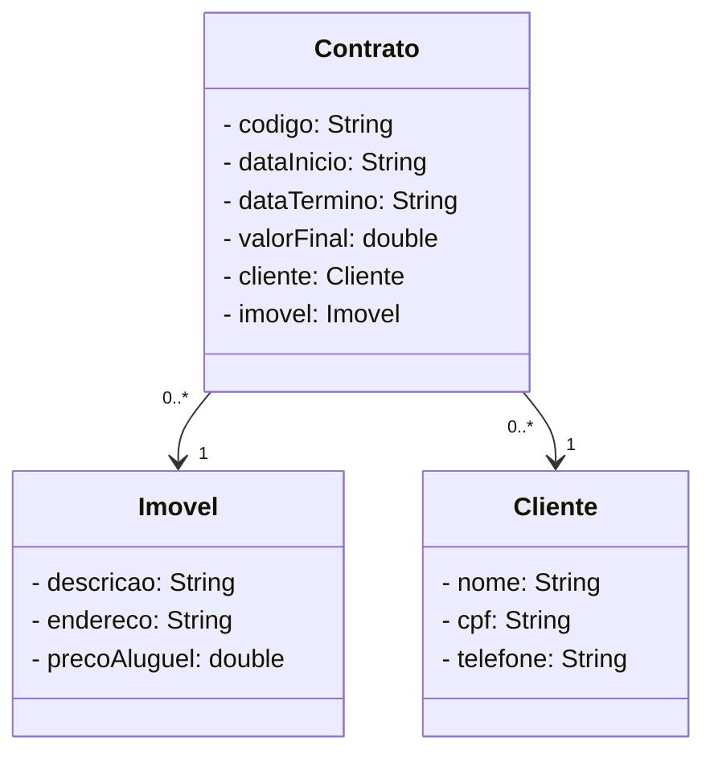

```mermaid
classDiagram
    direction TD
    
    class Imovel{
        - descricao: String
        - endereco: String
        - precoAluguel: double
        
    }
    
    class Cliente{
        - nome: String
        - cpf: String
        - telefone: String
    }
        
    class Contrato{
        - codigo: String
        - dataInicio: String
        - dataTermino: String
        - valorFinal: double
        - cliente: Cliente
        - imovel: Imovel
    }
        
    
    Contrato "0..*"-->"1" Imovel
    Contrato "0..*"-->"1" Cliente


```