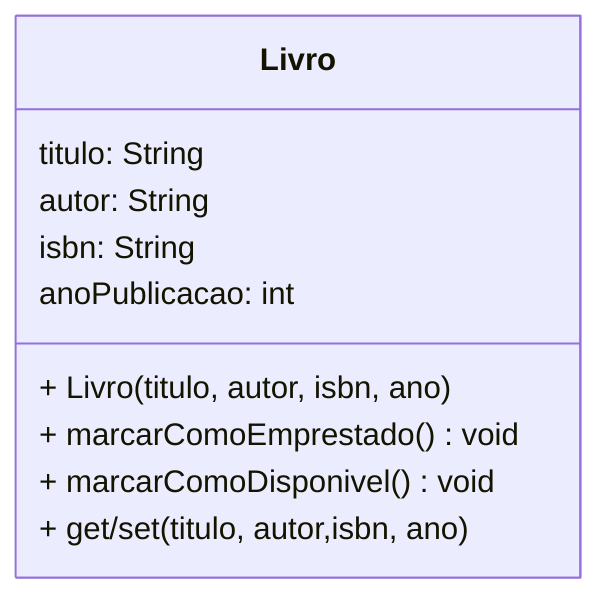
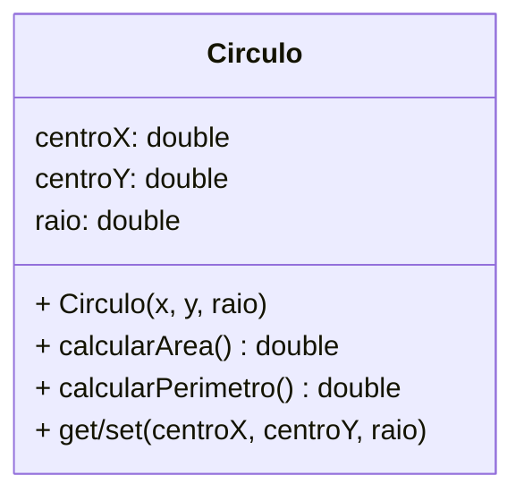
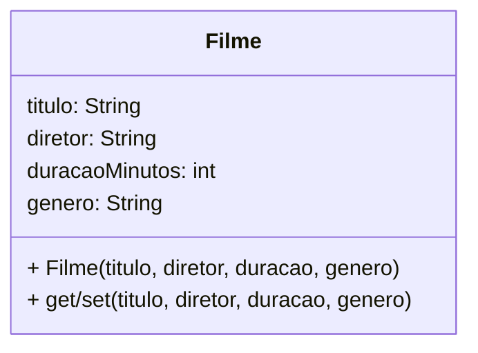
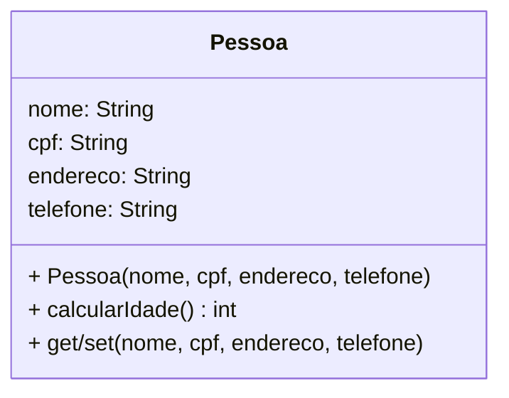
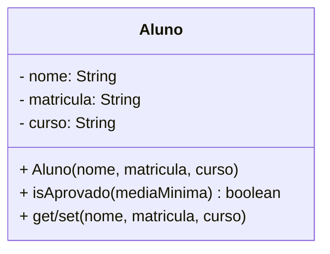
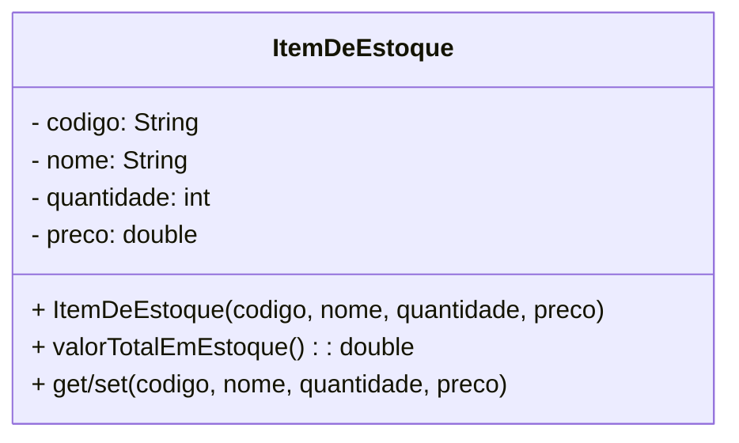
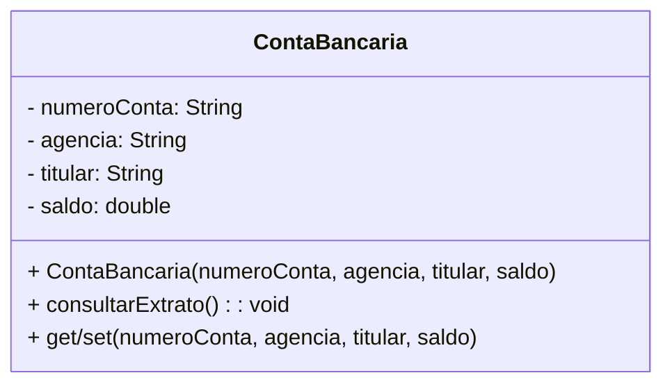

```mermaid
classDiagram
    class Livro{
        titulo: String
        autor: String
        isbn: String
        anoPublicacao: int
        + Livro(titulo, autor, isbn, ano)
        + marcarComoEmprestado() void
        + marcarComoDisponivel() void
        + get/set (titulo, autor,isbn, ano )
    }
    
```

```mermaid
classDiagram
    class Circulo{
        centroX: double
        centroY: double
        raio: double
        + Circulo(x, y, raio)
        + calcularArea() double
        + calcularPerimetro() double
        + get/set (centroX, centroY, raio)
    }
```

```mermaid
classDiagram
    class Filme{
        titulo: String
        diretor: String
        duracaoMinutos: int
        genero: String
        + Filme(titulo, diretor, duracao, genero)
        + get/set (titulo, diretor, duracao, genero)
    }
```

```mermaid
classDiagram
    class Pessoa{
        nome: String
        cpf: String
        endereco: String
        telefone: String
        + Pessoa(nome, cpf, endereco, telefone)
        + calcularIdade() int
        + get/set(nome, cpf, endereco, telefone) 
    }
```

```mermaid
classDiagram
    class Aluno{
        - nome: String
        - matricula: String
        - curso: String
        + Aluno (nome, matricula, curso)
        + isAprovado(mediaMinima) boolean
        + get/set(nome, matricula, curso)
    }
```

```mermaid
classDiagram
    class ItemDeEstoque{
        - codigo: String
        - nome: String
        - quantidade: int
        - preco: double
        + ItemDeEstoque(codigo, nome, quantidade, preco)
        + valorTotalEmEstoque(): double
        + get/set(codigo, nome, quantidade, preco)
    }
```

```mermaid
classDiagram
    class ContaBancaria{
        - numeroConta: String
        - agencia: String
        - titular: String
        - saldo: double
        + ContaBancaria(numeroConta, agencia, titular, saldo)
        + consultarExtrato(): void
        + get/set(numeroConta, agencia, titular, saldo)
    }
```
