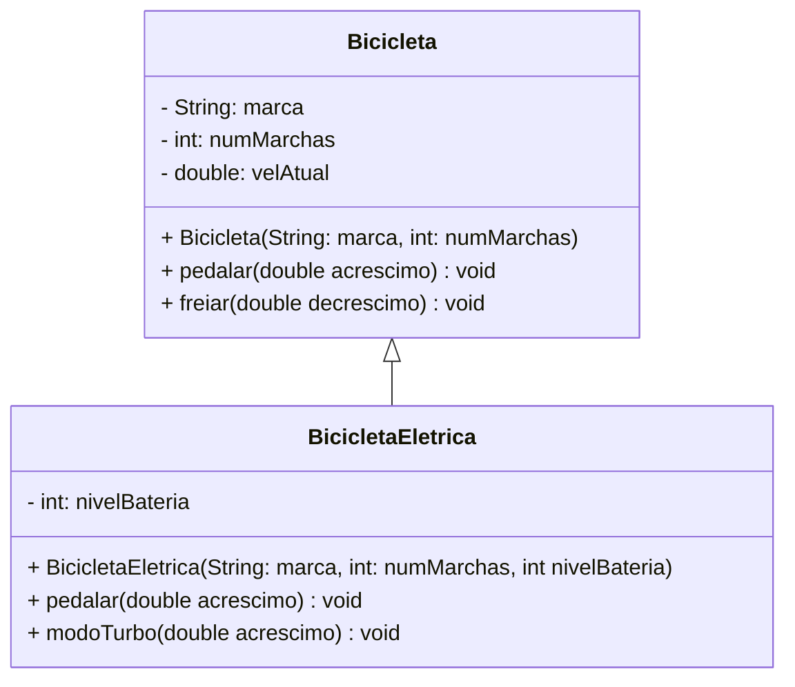

```mermaid
    classDiagram
        direction TD
        
        Bicicleta <|-- BicicletaEletrica
        
        
        class Bicicleta{
            - String: marca
            - int: numMarchas
            - double: velAtual

            + Bicicleta(String: marca, int: numMarchas)
            + pedalar(double acrescimo) void
            + freiar(double decrescimo) void
        }
        
        class BicicletaEletrica{
            - int: nivelBateria
            
            + BicicletaEletrica(String: marca, int: numMarchas, int nivelBateria)
            + pedalar(double acrescimo) void
            + modoTurbo(double acrescimo) void
        }
```