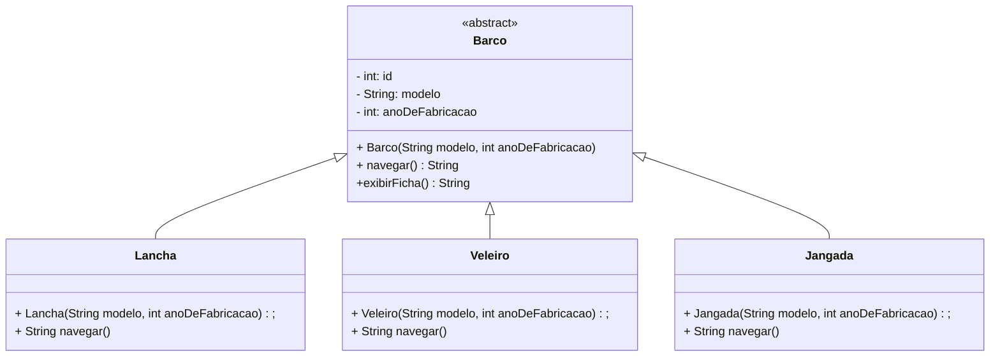

```mermaid
classDiagram
    direction TD
    
    Barco <|-- Lancha
    Barco <|-- Veleiro
    Barco <|-- Jangada
    
    class Barco{
        <<abstract>>
        - int: id
        - String: modelo
        - int: anoDeFabricacao
        
        + Barco(String modelo, int anoDeFabricacao)
        + navegar() String
        +exibirFicha() String
    }
    
    class Lancha{
        + Lancha(String modelo, int anoDeFabricacao);
        + String navegar()
    }
    
    class Veleiro{
        + Veleiro(String modelo, int anoDeFabricacao);
        + String navegar()
    }
    
    class Jangada{
        + Jangada(String modelo, int anoDeFabricacao);
        + String navegar()
    }
    
    


```