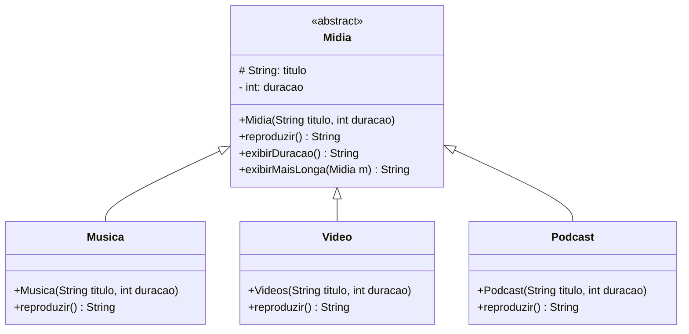

```mermaid
    classDiagram
        direction TD
        
        Midia <|-- Musica
        Midia <|-- Video
        Midia <|-- Podcast
        
        class Midia{
            <<abstract>>
            # String: titulo
            - int: duracao
            
            +Midia(String titulo, int duracao)
            +reproduzir() String
            +exibirDuracao() String
            +exibirMaisLonga(Midia m) String
        }
        
        class Musica{
            +Musica(String titulo, int duracao)
            +reproduzir() String
        }
        
        class Video{
            +Videos(String titulo, int duracao)
            +reproduzir() String
        }
        
        class Podcast{
            +Podcast(String titulo, int duracao)
            +reproduzir() String
        }
```