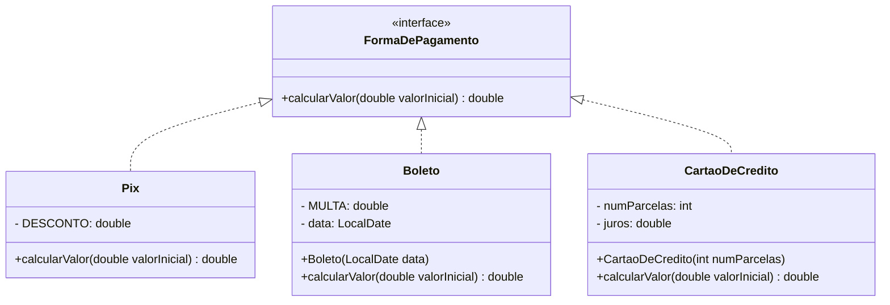

```mermaid
    classDiagram
        direction TD
        
        FormaDePagamento <|.. Pix
        FormaDePagamento <|.. Boleto
        FormaDePagamento <|.. CartaoDeCredito
        
        class FormaDePagamento{
            <<interface>>
            
            +calcularValor(double valorInicial)double
        }
        
        class Pix{
            - DESCONTO: double

            +calcularValor(double valorInicial)double
        }
        
        class Boleto{
            - MULTA: double
            - data: LocalDate

            +Boleto(LocalDate data)
            +calcularValor(double valorInicial)double
        }
        
        class CartaoDeCredito{
            - numParcelas: int
            - juros: double

            +CartaoDeCredito(int numParcelas)
            +calcularValor(double valorInicial)double
        }
```