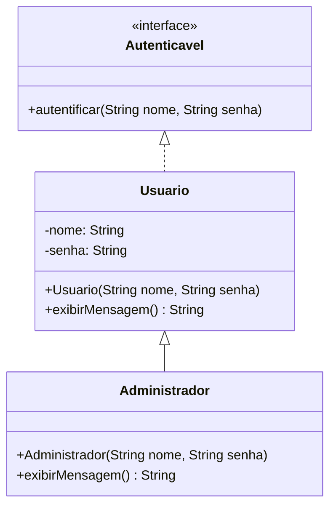

```mermaid
classDiagram
    direction TD
    
    Autenticavel <|.. Usuario
    Usuario <|-- Administrador
    
    class Autenticavel{
        <<interface>>
        +autentificar(String nome, String senha)
    }
    
    class Usuario{
        -nome: String
        -senha: String
        
        +Usuario(String nome, String senha)
        +exibirMensagem() String      
    }
    
    class Administrador{
        +Administrador(String nome, String senha)
        +exibirMensagem() String
    }
```