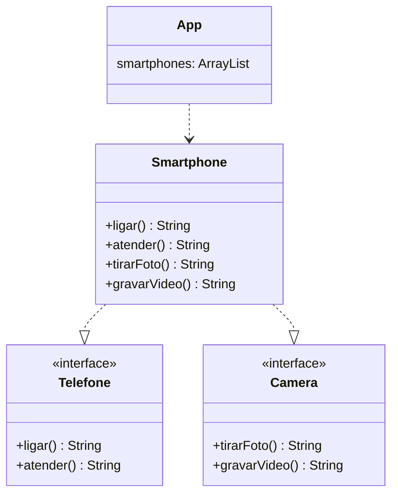

```mermaid
classDiagram
    direction TD
    
    Smartphone ..|> Telefone
    Smartphone ..|> Camera
    App ..> Smartphone
    
    class Smartphone{
        +ligar() String
        +atender() String
        +tirarFoto() String
        +gravarVideo() String
    }
    
    class Telefone{
        <<interface>>
        +ligar() String
        +atender() String
    }
    
    class Camera{
        <<interface>>
        +tirarFoto() String
        +gravarVideo() String
    }
    
    class App{
        smartphones: ArrayList<Smartphone>
    }
```