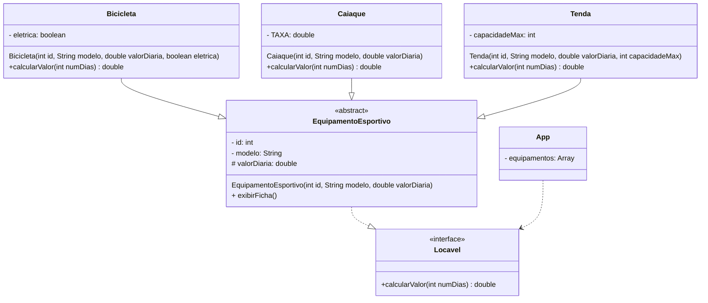

```mermaid
classDiagram
    direction TD
    
    Bicicleta --|> EquipamentoEsportivo
    Caiaque --|> EquipamentoEsportivo
    Tenda --|> EquipamentoEsportivo
    EquipamentoEsportivo ..|> Locavel
    App ..> Locavel
    
    class App{
        - equipamentos: Array<EquipamentoEsportivo>
    }
    
    class EquipamentoEsportivo{
        <<abstract>>
        - id: int
        - modelo: String
        # valorDiaria: double

        EquipamentoEsportivo(int id, String modelo, double valorDiaria)
        + exibirFicha()
    }
    
    class Locavel{
        <<interface>>
        +calcularValor(int numDias) double
    }
    
    class Bicicleta{
        - eletrica: boolean 
        Bicicleta(int id, String modelo, double valorDiaria, boolean eletrica)
        +calcularValor(int numDias) double
    }
    
    class Caiaque{
        - TAXA: double
        Caiaque(int id, String modelo, double valorDiaria)
        +calcularValor(int numDias) double
    }
    
    class Tenda{
        - capacidadeMax: int
        Tenda(int id, String modelo, double valorDiaria, int capacidadeMax)
        +calcularValor(int numDias) double
    }
    
    
```